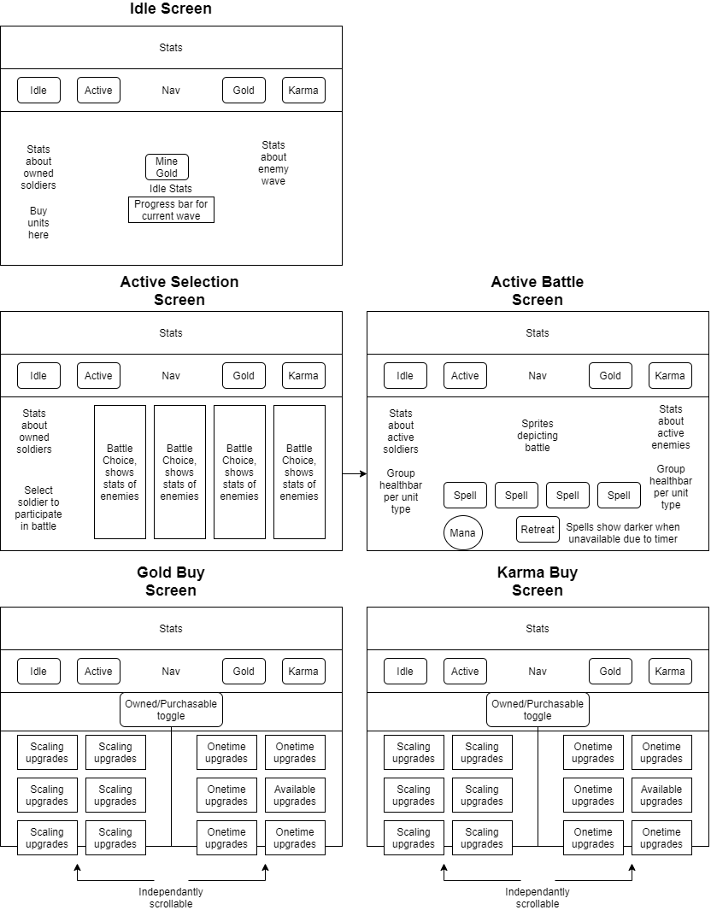

# IdleGame
IdleGame TBA by Errol and Trevor

TOC

## Overview
A simple game using Idle mechanics in which the player must defend a medieval village from monsters. There are two main types of progression in the game, idle and active. Idle progression consists of gaining resources over time based on current soldiers defeating monsters while defending village and active progression consists of proactive hunting of monsters in their own lairs.

## Team
- Errol Highberg
- Trevor Smith-Holbourn

## MVP Features
The player can:
- Mine for gold and use it to buy soldiers
- Send their armies into battle to gain karma, the prestige currency
- Cast powerful spells to aid their soldiers in battle
- Watch them duke it out with the enemy in exciting sprite combat
- Buy upgrades using earnt gold and karma
- Save, load and export progress in the game using local storage

## Post MVP Features
The player can:
- Utilize their own stengths and enemy weaknesses to defeat them in battle
- Participate battle minigame with particle simulation, like a miniature RTS the player could target AOE spells
- Enjoy an expanded economic system

## Wireframes

## Component Heirarchy

## Component Breakdown
| Page | Description|
|:----------:|:--------------------------------------------:|
|Options|Non game administrative functions such as save and load game|
|Idle|Displays the idle progression of the game|
|ActiveSelection|Displays potential battle choices and their risks and rewards|
|ActiveBattle|Displays the currently selected and in progress battle|
|KarmaStore|Displays owned and purchasable upgrades using the prestige currency (Karma)|
|GoldStore|Displays owned and purchasable upgrades using the primary currency (Gold)|

 

| Component | Description|
|:----------:|:--------------------------------------------:|
|Nav|Allows player to navigate through the different game screens|
|Main|Houses the sub components for the active route|
|StatsBar|Displays globally relevant stats|
|SoliderList|Displays many soldier cards|
|SoldierCard|Displays information about one type of solider, with a contextual sub-component for specific routes|
|EnemyList|Displays many enemy cards, with a contextual sub-component for specific routes|
|EnemyCard|Displays information about one type of enemy, with a contextual sub-component for specific routes|
|ChoiceList|Displays available choice cards|
|ChoiceCard|Displays risk and reward of choice as well as enemy list|
|SpellBar|Contains spell buttons, manabar and retreat button|
|BattleSprites|A visualization of the current battle|
|Healthbar|Displays current health of a group of soldiers or enemies|
|BuySoldierButton|Soldier sub-component for buying new soliders of a given type|
|ParticipateButtons|Soldir sub-component for selecting units to participate in an active battle|
|Store|A composition of the store sub-components|
|UpgradeList|Displays many UpgradeCards|
|UpgradeCard|Displays info about owned and purchasable upgrades|
 

## Libraries
- React
- React Router
- TailwindCSS

## Data
| Component | Description|
|:----------:|:--------------------------------------------:|
|Units|Definitions for soldiers and enemy units, inluding cost, damage, health, unlocked at and name|
|Upgrades|Definitions for karma and gold upgrades|

## Issues and Resolutions

### Expected Issues
- Games can be more complex than apps in some respects and thus it may be harder to complete
- Games need to work but also need to be fun
- Permanancy of local storage (or lack there of) may cause issues
- Idle games need to update the statistics frequently which may result in many changes to the DOM per second, this may have unexpected difficulties

### Encounted Issues
